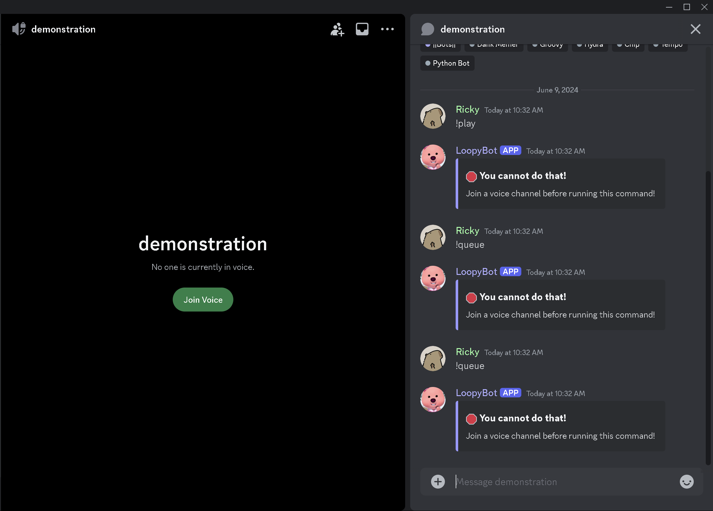
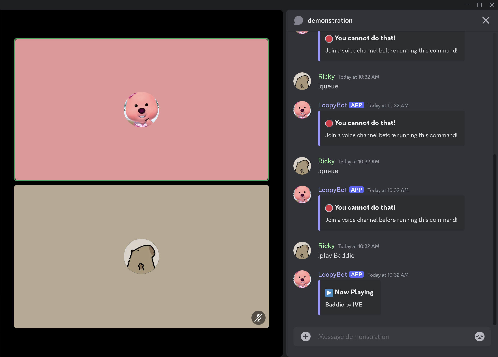
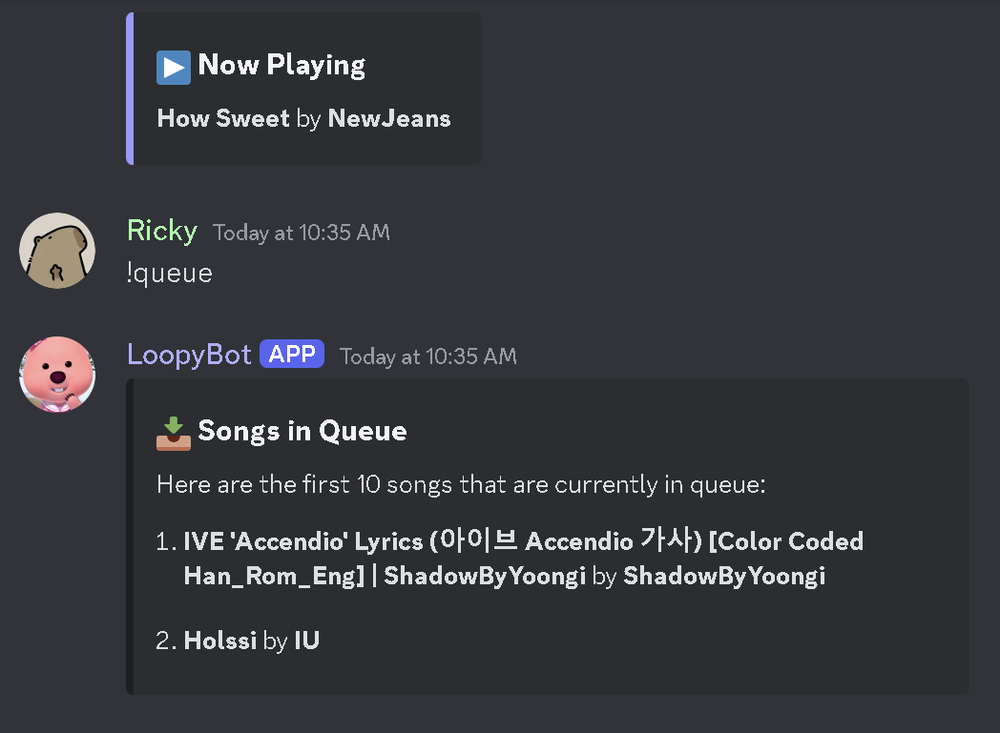
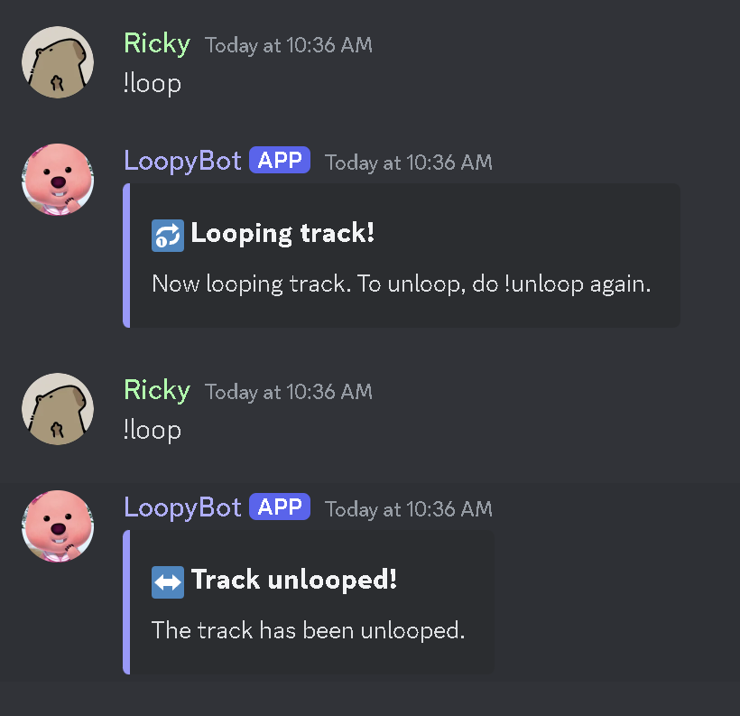
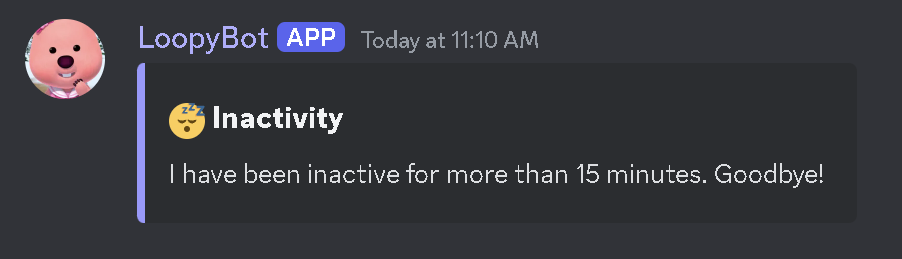

# Loopybot 🤖

💠Loopybot is my Discord music bot coded using Python 3.0, the Discord.py and Wavelink libraries. 

💠Its name comes from the popular cartoon character, Loopy, and the fact that the bot is capable of looping a song. 

## Documentation 📋

💠Loopybot has 11 main commands, and a help command.

💠 Those commands are:

1. !play <song>
2. !queue <song> (optional)
3. !unqueue <position>
4. !skip
5. !pause
6. !unpause
7. !jump <position>
8. !clear
9. !disconnect
10. !back
11. !loop

## Play Command ▶️

Stops the current playing song (if any), then searches for and plays the song given by the user.

<b>Format</b>: !play *song*

<b>Aliases</b>: !p, !pl, !plays

*song* can be a YouTube URL or Spotify URL, or it can be treated as a search query (type as if you are searching for a song on YouTube).

## Queue Command 📤

Searches for and adds the song given by the user. If no song is currently playing, it will behave like the !play command. 

<b>Format</b>: !queue *song (optional)*

<b>Aliases</b>: !q, !queues, !queued

*song* behaves similarly with !play. If no song is provided, the command will display the first 10 songs in queue. 

## Unqueue Command 📤

Removes the song at the position given by the user.

<b>Format</b>: !unqueue *position*

<b>Aliases</b>: !unq, !unqueued, !uq

*position* is an integer and must exist within the queue. If a queue has 3 songs and the user enters 4, the bot will tell them it doesn't exist. 

## Skip Command ⏭

Stops the current playing song and plays the next song in queue. If there is no song in queue, the bot will only stop playing the current song. 

<b>Format</b>: !skip

<b>Aliases</b>: !s, !sk, !skipp, !skipped, !skips

## Pause Command ⏸

If a song is playing, the bot will pause it. 

<b>Format</b>: !pause

<b>Aliases</b>: !pauses, !paused, !pa

## Unpause Command ▶️

If a song is paused, the bot will resume playing it.

<b>Format</b>: !unpause

<b>Aliases</b>: !unpauses, !unpaused, !unpa

## Jump Command ⤵️

Stops the current song and deletes all songs in queue before the position given by the user. Then, plays the song at the given position.

<b>Format</b>: !jump *position*

<b>Aliases</b>: !j, !jumped, !jumps, !jumpp

*position* is an integer and must exist within the queue. If a queue has 3 songs and the user enters 4, the bot will tell them it doesn't exist.

## Clear Command 🗑

Stops the current playing song if any and deletes all songs in the queue. This command also clears the queue history, which means that !back will not work/remember the last played song.

<b>Format</b>: !clear

<b>Aliases</b>: !c, !cl, !clears, !clearr

## Disconnect Command 👋

Runs the clear command internally, and disconnects the bot from the voice channel.

<b>Format</b>: !disconnect

<b>Aliases</b>: !dc, !disc, !quit, !disconnected

## Back Command ⏪

Stops the current playing song and puts it back into the first position in queue. Then plays the last played song. 

<b>Format</b>: !back

<b>Aliases</b>: !b, !ba

## Loop Command 🔂

Loops the current song if it is not looped, else vice versa. Currently, there is no option to loop the queue. 

<b>Format</b>: !loop

<b>Aliases</b>: !lp, !looped, !track

## Screenshots

## License

This repo is public. I only ask that you credit me in your work. You must not copy this code and pass it off as your own. 

